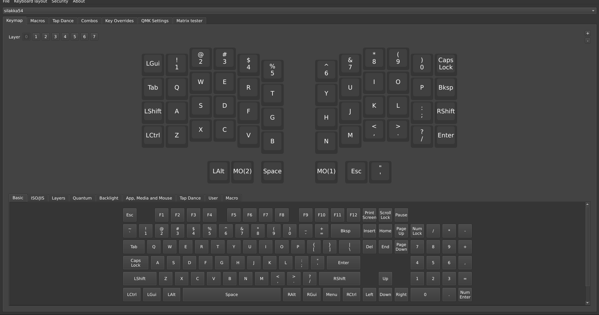
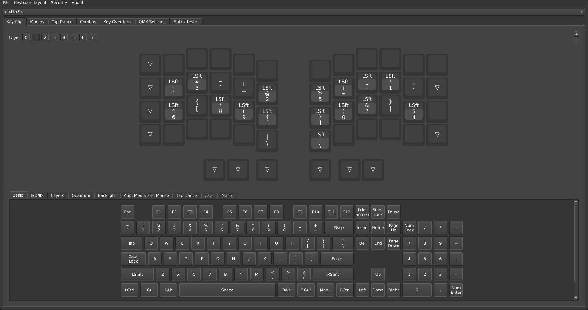
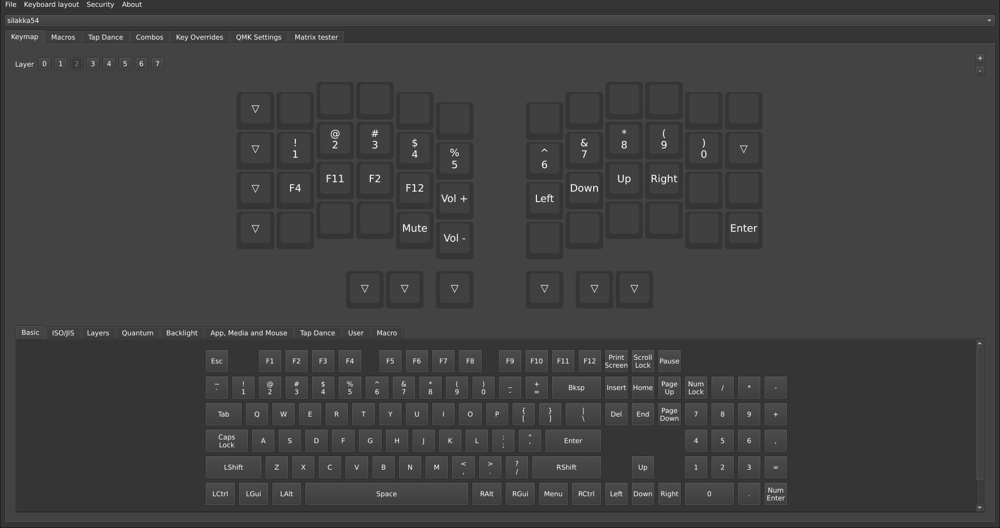

# Silakka54 (Vial) Layout

## Overview

In short, my layout is focused on ergonomics and Vim. Personally, typing on end with this layout allows programming to be finally flow smoothly.

This layout was created with Vim and C in mind, though it's not overly specific to C.
If you're a Vim user as well, you'll be able to understand that the key-placement was intentional.

If you decide to use the layout, enjoy.

## Layers 0-2

### Layer 0

### Layer 1

### Layer 2

