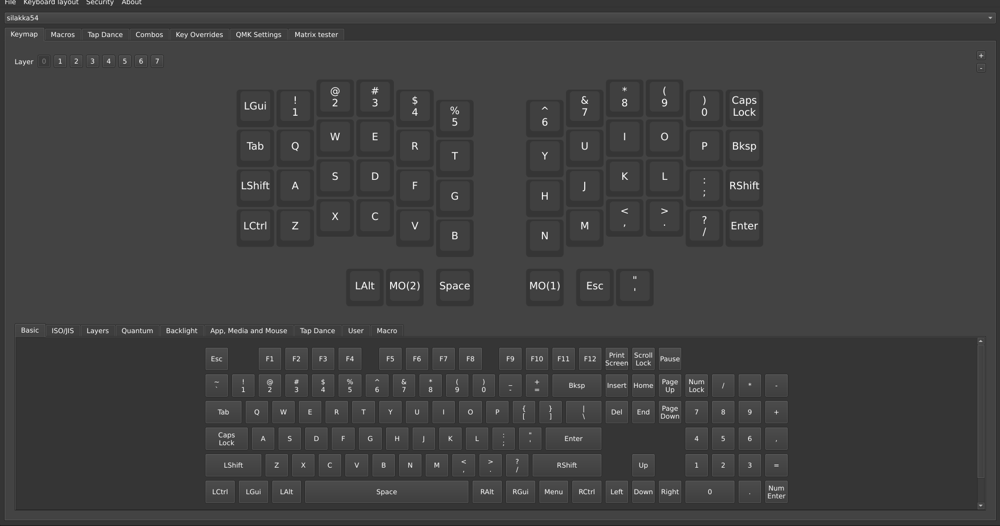
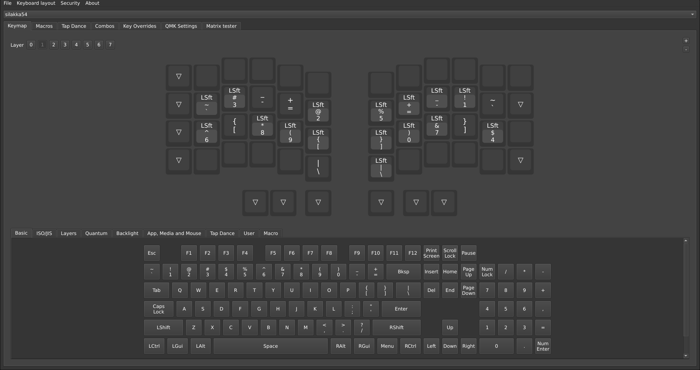
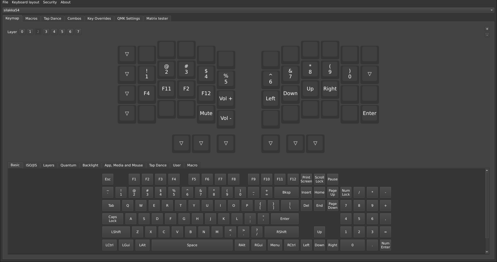

# My Silakka54 Layout (Vial)

## Overview

My layout's focused on ergonomics and Vim. Personally,
it allows me to type for many hours comfortably.
Despite the layout being created with Vim and C in mind,
it's not overly specific to C. Also, if you're a Vim-head
as well, you'll be able to appreciate the intentional key
placement.

If you decide to use the layout, enjoy, and a star would
be appreciated.

## Layers 0-2

### Layer 0

### Layer 1

### Layer 2

